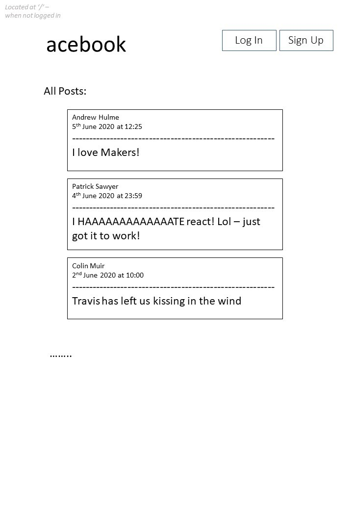
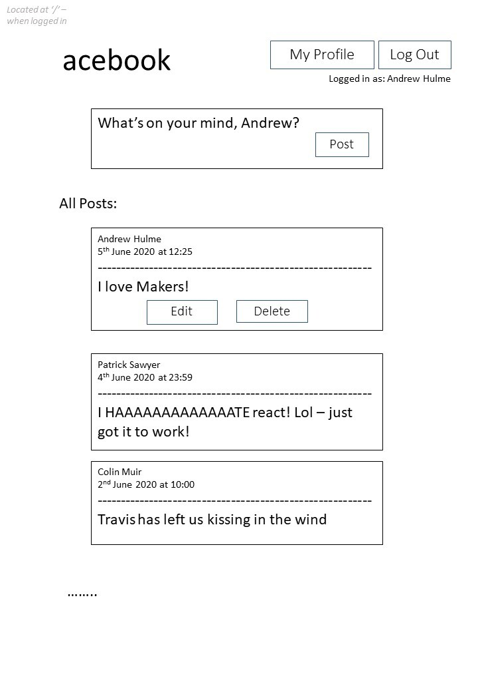
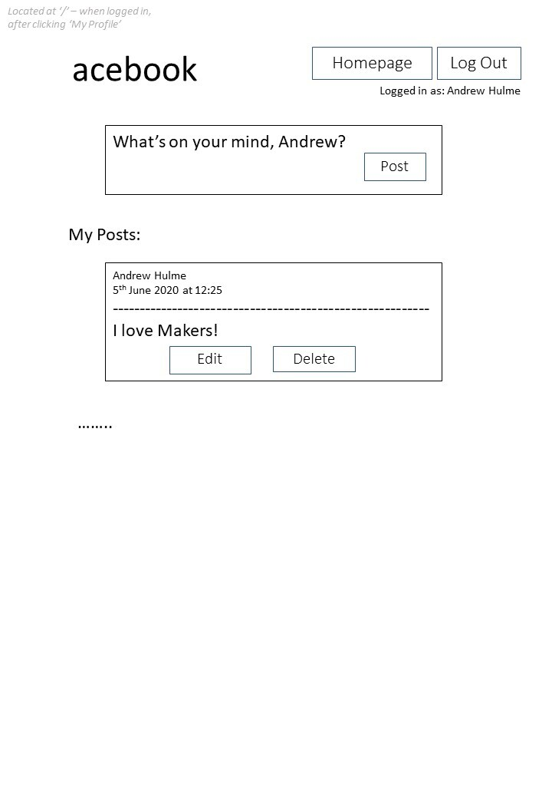
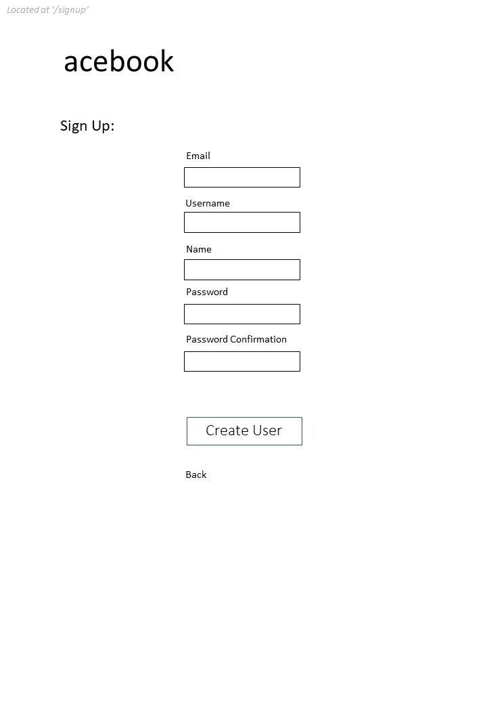
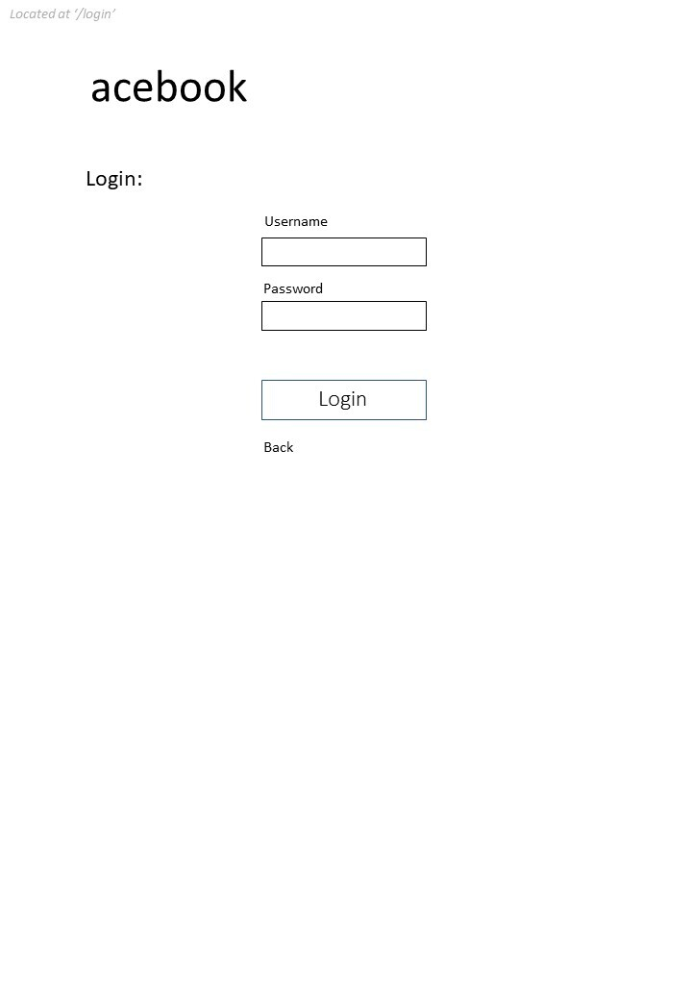

[](https://travis-ci.com/github/AndrewHulme/acebook-the-fat-controllers)

# AceBook

This project has split into two repos - to be updated.

REQUIRED INSTRUCTIONS:

1. Fork this repository to `acebook-teamname` and customize
the below**

[You can find the engineering project outline here.](https://github.com/makersacademy/course/tree/master/engineering_projects/rails)

2. The card wall is here: <please update>

## How to contribute to this project
See [CONTRIBUTING.md](CONTRIBUTING.md)

## Quickstart

First, clone this repository. Then:

```bash
$ bundle install
$ npm install
$ bin/rails db:create
$ bin/rails db:migrate

$ bundle exec rspec # Run the tests to ensure it works
$ bin/rails server # Start the server at localhost:3000
```

*Note*  

Run `bundle update` to solve following issue:
```
Bundler could not find compatible versions for gem "unicode-display_width"
```

## Testing

To run RSpec (with Capybara), Rubocop, Jasmine in Karma and ESLint run script:  
```bash
$ ./test/tdd.test`
```

To test in browser (uses Chrome), run script:  
```bash
$ ./test/web.test
```

This will load `localhost:3000` into the browser, then starts Rails. Refresh page once Rails is up and running.


## Trello

https://trello.com/b/Trq2bnqd/acebook-rails-the-fat-controllers

## Mock Ups






